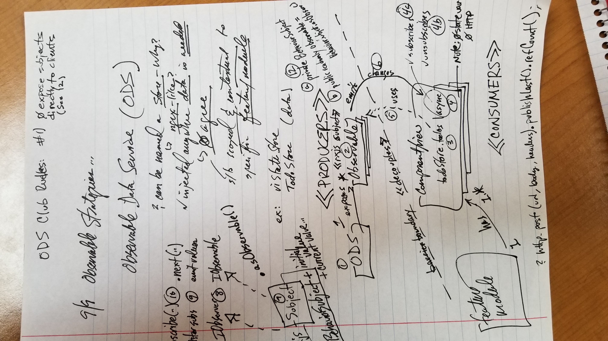

# Observable Data Service (ODS)

I jotted down some notes while reading some articles on using RxJS Observables for a Data Service. This promotes the practice of using reactive patterns and pushing data to consumers as needed. This is a simple and practical example of doing this.

I like to draw a picture representing the topic and see the relationships between the things discussed. 

<!--  -->

## Observations

I created another diagram using the items from my original notes.

1. Observable Data Service (a.ka. ODS): an alternate way to provide data services to consumers. Note the boundary between the consumer and producer of data. 
2. Use Observables to provide data to consumers. Supports a reactive flow of data to consumers.
3. Components and Views are consumers of the Observable data
4. The `async` pipe provides the capability to subscribe and unsubscribe to the data stream. Ex: `todos$ | async` 
5. The consumer view uses `Observable` contained in the ODS.
6. The ODS will emit changes/updates to the `Observable` (connected data stream).
7. The ODS implements a `Subject` type. 
8. The `Subject` implements `IObserver` and `IObservable`.
9. Allows for consumers to register for events; it can also emit changes to data.
10. Provides the `subscribe()` method to register for events. The `Subject` emits data using the `next()` method.
11. Use the `BehaviorSubject` to overcome limitations of the `Subject`. BehaviorSubjects allow for an initial value and a method to retrieve the current value.
12. The *Producer* manages data with the *BehaviorSubject* and provides data via the *Observable*: 
    *  Initialize a `private data: BehaviorSubject = new BehaviorSubject([]);` with default data. 
    * Provide a `public readonly todos$: Observable = this.data.asObservable();` that allows consumers to use/access the Observable.

> Note: The `BehaviorSubject` is private. Never expose *Subjects* directly to consumers.


### Producer

Things to note:

* do not allow or provide access to the `BehaviorSubject` or whatever subject type you implement
  * keeps consumers of the data save from modifying or producing data using the *subject*
* use `readonly` to initialize the data with the property or in the constructor of the class; consumers cannot modify instance - only use it
* use the `$` suffix to indicate that the property is an `Observable` type

```ts
private data: BehaviorSubject: new BehaviorSubject([]);
public readonly todos$: Observable<List<Todo>> = this.data.asObservable();

constructor(private todoBackendService: TodoBackendService) {
    this.initializeData();
}
```

### Consumers

Things to note (not much):

* use the `async` pipe to subscribe to and unsubscribe from the Observable.
* the component does not have any state variables (i.e., No `Observable` varialbes)
* there are no HTTP calls made from the component - data is provided by the ODS via the Observable.

```html
<ul *ngFor="let item of myODSSerivce.todos$ | async">
   <li>{{item.name}}</li>
</ul>
```

## Resources
* [How to build Angular apps using Observable Data Services](https://blog.angular-university.io/how-to-build-angular2-apps-using-rxjs-observable-data-services-pitfalls-to-avoid/)
* [Managing state in Angular 2 using RxJs](https://medium.com/front-end-developers/managing-state-in-angular-2-using-rxjs-b849d6bbd5a5#.g65l2qriq)
* [3 Common Rxjs Pitfalls that you might find while building Angular Applications](https://blog.angular-university.io/angular-2-rxjs-common-pitfalls/)

# RxJS: first() or take(1) or single()

## Resources

* [Emit the first value or first to pass provided expression](https://www.learnrxjs.io/operators/filtering/first.html)
* [Angular 2 using RxJS - take(1) vs first()
](https://stackoverflow.com/questions/42345969/angular-2-using-rxjs-take1-vs-first)